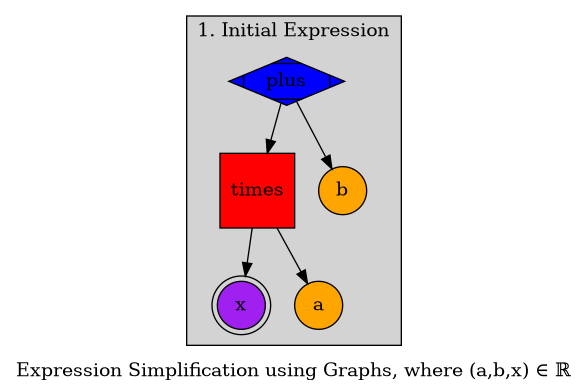
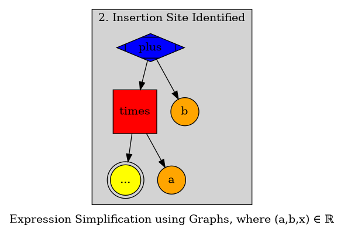
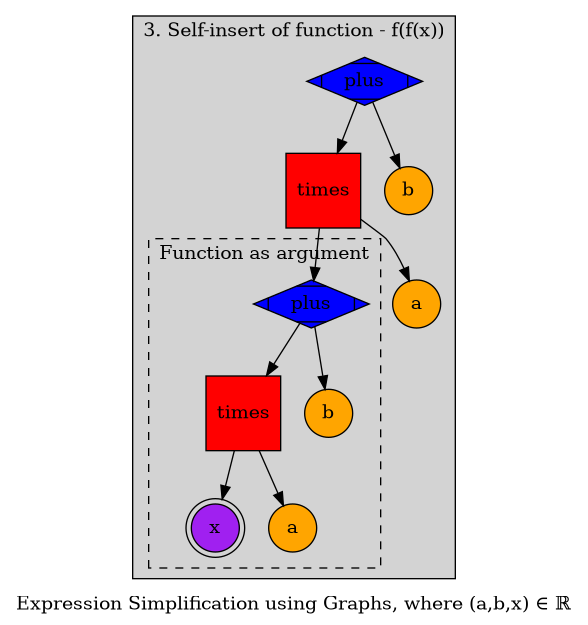
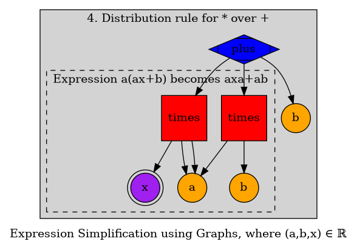
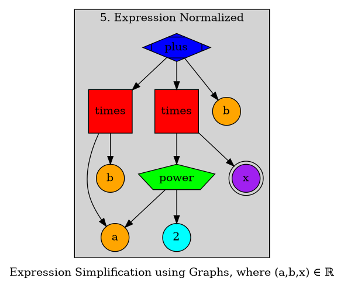

# Normalizing A Single Iteration of an Expression

## Introduction
Using the equation `f(x)=ax+b` as my pedagogical tool of choice, I want to demonstrate how a single iteration of the function `f` is normalized. I will use graphs to model this process.

### Qualification
Expect this example to be rough. I plan to simplify my graph formalisms for the normalization in future graphs. Right now, every operation and operand, including the function variable `x` is a vertex. The edges contain no information right now. Expect that to change in the future.

## Algebraic Normalization
Normalization in this context refers to some constituent algebraic form of an expression that cannot be reduced any further. I will play rather loose with that word; just know that I want to show a step by step reduction starting from the composition `f∘f`.

### Normalization Process
The following four steps are what I will graphically model,

1. `f(x)=ax+b`

2. Identify **function** variable

3. `(f∘f)(x)=f(f(x))=a(ax+b)+b`

4. `a(ax+b)+b=aax+ab+b`

5. `a(ax+b)+b=a`2`+ab+b`

